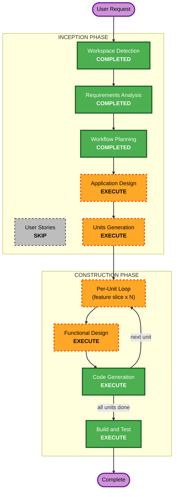

# Execution Plan

## Detailed Analysis Summary

### Change Impact Assessment
- **User-facing changes**: Yes - 新規プラットフォーム全体（Seed/Log/Louge/プロフィール）
- **Structural changes**: Yes - Next.js + FastAPI + Supabase の新規構築
- **Data model changes**: Yes - Planter/Seed/Log/Louge/User/Tag 等の全テーブル新規作成
- **API changes**: Yes - REST API 全エンドポイント新規作成
- **NFR impact**: No - MVP フェーズのため最適化不要。AI処理は非同期で十分

### Risk Assessment
- **Risk Level**: Medium（新規構築のため既存影響なし。ただし AI 統合・スコアリングは複雑度あり）
- **Rollback Complexity**: Easy（グリーンフィールド）
- **Testing Complexity**: Moderate（AI パイプライン + スコアエンジンのテストが主な複雑箇所）

---

## Workflow Visualization



### Text Alternative
```
Phase 1: INCEPTION
  - Workspace Detection      (COMPLETED)
  - Requirements Analysis     (COMPLETED)
  - User Stories              (SKIP)
  - Workflow Planning         (COMPLETED)
  - Application Design        (EXECUTE)
  - Units Generation          (EXECUTE)

Phase 2: CONSTRUCTION (per-unit loop)
  Per Unit:
    - Functional Design       (EXECUTE)
    - NFR Requirements        (SKIP)
    - NFR Design              (SKIP)
    - Infrastructure Design   (SKIP)
    - Code Generation         (EXECUTE)
  After all units:
    - Build and Test          (EXECUTE)
```

---

## Phases to Execute

### INCEPTION PHASE
- [x] Workspace Detection (COMPLETED)
- [x] Reverse Engineering (SKIP - greenfield)
- [x] Requirements Analysis (COMPLETED)
- [ ] User Stories - **SKIP**
  - **Rationale**: 一人開発。要件定義書に詳細なユーザーシーンが既にある。ペルソナ定義は事業計画書に含まれている（Seeker / Contributor）。ユーザーストーリーを別途生成しても新たな知見は得られない
- [x] Workflow Planning (IN PROGRESS)
- [ ] Application Design - **EXECUTE**
  - **Rationale**: 新規サービスの全コンポーネント設計が必要。Planter/Seed/Log/Louge のドメインモデル詳細、API エンドポイント定義、Louge スコアエンジンのアーキテクチャ設計が必要
- [ ] Units Generation - **EXECUTE**
  - **Rationale**: feature slice 単位でユニットを分割する。UI + API をセットにした縦スライスで、各ユニット完了ごとに動作確認可能な構成にする

### CONSTRUCTION PHASE (Per-Unit Loop)
- [ ] Functional Design - **EXECUTE**
  - **Rationale**: 各ユニットの DB スキーマ・API 仕様・ビジネスロジックの詳細設計が必要。ユニットごとに実施
  - **NOTE**: Louge 生成のバックグラウンドジョブ設計（トリガー方式: FastAPI BackgroundTasks / Cloud Tasks / Pub/Sub の選定）を、該当ユニットの Functional Design で必ず決定すること
- [ ] NFR Requirements - **SKIP**
  - **Rationale**: NFR は要件定義で確定済み（Cloud Run + Supabase + 構造化ログ）。MVP フェーズのため追加の NFR 分析は不要
- [ ] NFR Design - **SKIP**
  - **Rationale**: NFR Requirements をスキップするため
- [ ] Infrastructure Design - **SKIP**
  - **Rationale**: Cloud Run + Supabase の構成は確定済み。Docker/CI は Code Generation 内で対応可能
- [ ] Code Generation - **EXECUTE** (ALWAYS)
  - **Rationale**: 各ユニットの実装。Figma MCP でデザインを参照しながら UI + API をセットで実装
- [ ] Build and Test - **EXECUTE** (ALWAYS)
  - **Rationale**: 全ユニット完了後のビルド・テスト検証

### OPERATIONS PHASE
- [ ] Operations - PLACEHOLDER

---

## Unit Strategy: Feature Slice (Vertical)

ユーザーの要望に基づき、以下の原則でユニットを分割する：

| 原則 | 内容 |
|---|---|
| **Feature Slice** | 機能単位の縦スライス（UI + API + DB をセットで実装） |
| **都度動作確認** | 各ユニット完了時点でブラウザから動作確認可能 |
| **Figma 参照** | UI 実装時は Figma MCP でデザインを取得し忠実に実装 |
| **小さく切る** | 1ユニットは 1-2 セッションで完了する粒度を目指す |

ユニットの具体的な分割は **Units Generation** ステージで決定する。

**Units Generation での注意事項**:
- Louge スコアエンジン（FR-05）は API・バックグラウンドジョブ・AI パイプラインにまたがる。単純な feature slice では切れない可能性があるため、依存関係を考慮した分割が必要
- Louge 生成（FR-06）のバックグラウンドジョブトリガー方式は、該当ユニットの Functional Design で確定すること（Infrastructure Design スキップのため）

---

## Success Criteria
- **Primary Goal**: Works Logue MVP の動作するプロトタイプ完成
- **Key Deliverables**: Seed 投稿 / Log 投稿 / Louge 開花 / プロフィール が動く状態
- **Quality Gates**: TypeScript strict / Ruff+mypy / 核心フローの E2E テスト

---

## Extension Compliance Summary
| Extension | Status | Notes |
|---|---|---|
| Security Baseline | Disabled | MVP フェーズ、Requirements Analysis で opt-out 済み |
| Property-Based Testing | Disabled | MVP フェーズ、Requirements Analysis で opt-out 済み |
